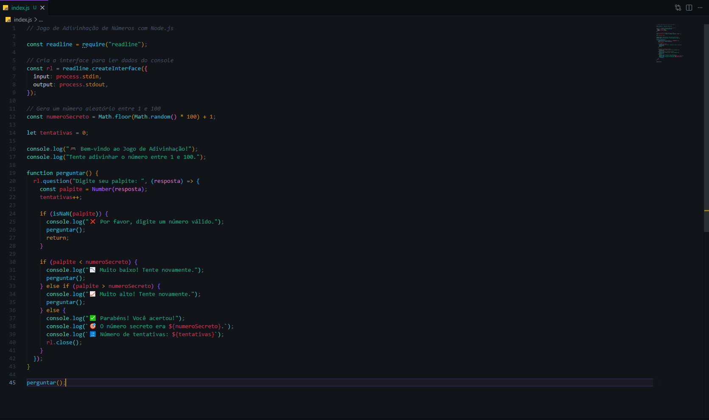

# 🎯 Jogo de Adivinhação de Números

Projeto desenvolvido em **Node.js, HTML, CSS e JavaScript**, onde o usuário precisa adivinhar um número secreto entre **1 e 100**.

O jogo informa se o palpite está muito alto, muito baixo ou correto, além de exibir o número de tentativas realizadas.

---

## 📸 Preview do Projeto

### Interface do jogo


### Código do projeto



---

## 🚀 Tecnologias Utilizadas

- Node.js
- Express
- HTML5
- CSS3
- JavaScript

---

## 🎮 Funcionalidades

- Gera um número aleatório entre 1 e 100
- Permite o usuário inserir palpites
- Informa se o número é maior ou menor
- Conta o número de tentativas
- Interface visual moderna
- Backend conectado com frontend

---

## 📁 Estrutura do Projeto

```bash
number-guessing-game-node/
│
├── images/
│   ├── codigo.png
│   └── frontend.png
│
├── public/
│   ├── index.html
│   ├── style.css
│   └── script.js
│
├── index.js
├── package.json
└── README.md
⚙️ Como Rodar o Projeto

Clone o repositório:

git clone LINK_DO_SEU_REPOSITORIO

Entre na pasta:

cd number-guessing-game-node

Instale as dependências:

npm install

Inicie o servidor:

npm start

Abra no navegador:

http://localhost:3000
🧠 Como Funciona

O backend em Node.js gera um número aleatório entre 1 e 100.

O frontend envia o palpite do usuário para o backend, que verifica se o número digitado é maior, menor ou igual ao número secreto.

Quando o usuário acerta, o jogo mostra a quantidade total de tentativas.

👨‍💻 Autor

Desenvolvido por Vitor Dutra Melo.
